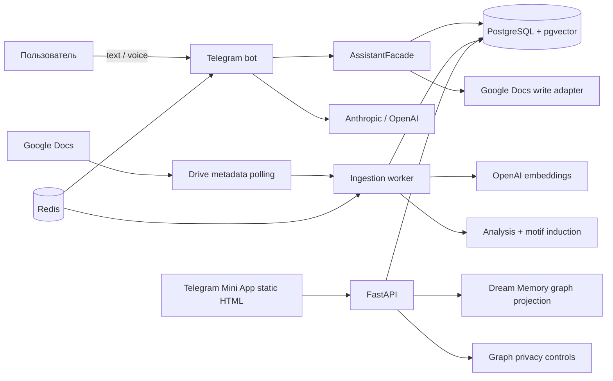
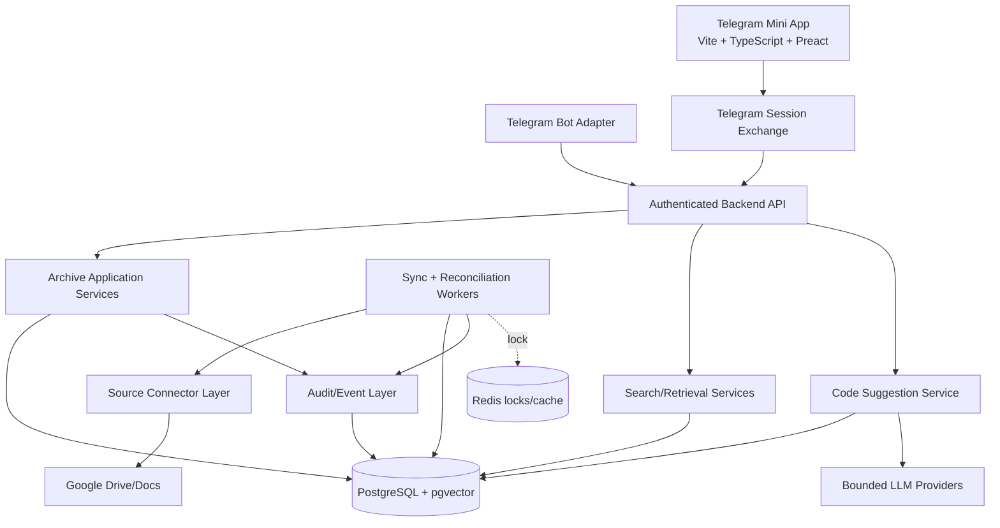
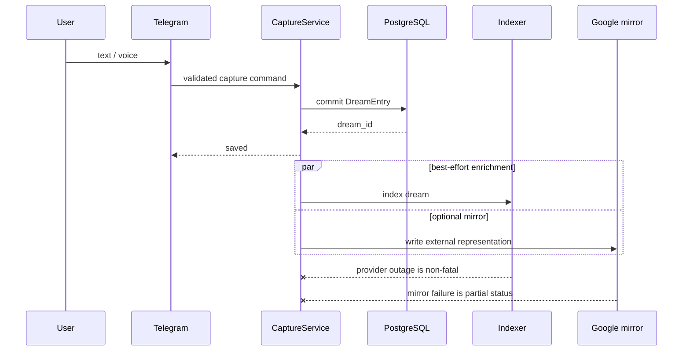
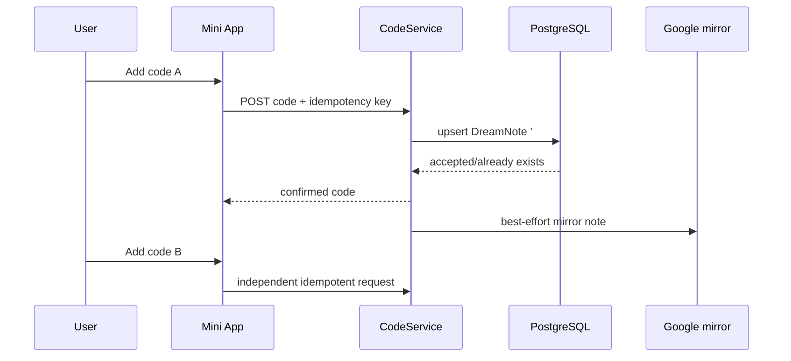
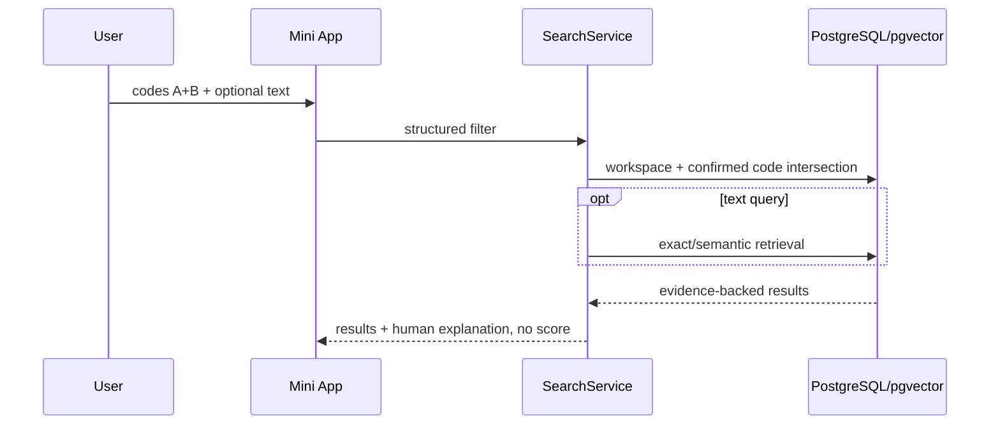

# Dream Motif Interpreter — аудит private beta

Дата исследования: 2026-07-18  
Исследованный HEAD `main`: `b1fb304abc90d8f5c4f59af8e16002f47734522d`  
Рабочая ветка: `audit/private-beta-foundation-2026-07-18`  
Целевая планка: production-ready private beta для одного оператора, без заявления о готовности к публичному multi-user запуску.

## 1. Executive verdict

**Вердикт: NO-GO для внешней private beta; CONDITIONAL GO для одного технически поддерживаемого оператора после завершения P0.**

Проект уже содержит сильное прикладное ядро: детерминированный intake, PostgreSQL + pgvector, bounded assistant facade, Telegram text/voice, Google Docs adapter, sync state, grounded retrieval, motif provenance, privacy controls и CI. Это не «игрушечный бот».

Основной риск находится не в отсутствии ещё одного AI-функционала, а в несогласованных продуктовых обещаниях:

- код считает PostgreSQL каноническим хранилищем, а пользовательский язык часто называет Google Docs архивом;
- Google Docs интеграция является периодическим import/write-through адаптером, но местами описывается как двусторонняя синхронизация;
- текущая Mini App показывает технический граф, но не решает базовые задачи архива, кодирования и понятной синхронизации;
- кнопка Delete в Mini App создаёт только graph-output control и не удаляет исходный сон;
- «экспорт» графа не является полным экспортом архива;
- часть критичного conversational state живёт в памяти процесса и исчезает после рестарта;
- до этой ветки сбой embeddings мог удалить уже созданный сон из управляемого архива;
- задокументированный Compose-контур не был воспроизводим: отсутствовал Dockerfile, API и auto-sync не были объявлены в `docker-compose.yml`.

Рекомендация: сохранить доменное ядро, Telegram capture и retrieval; рефакторить sync/state/API; заменить graph-first Mini App на archive-first рабочее пространство. Big-bang rewrite backend не нужен.

## 2. Фактическая архитектура

### 2.1. Наблюдаемая схема



### 2.2. Реальные границы

- `app/telegram/` — адаптер Telegram и long polling.
- `app/assistant/` — bounded tool loop и facade; ORM не отдаётся в LLM loop.
- `app/models/` — PostgreSQL модели с UUID и append-oriented audit в отдельных доменах.
- `app/retrieval/` — ingestion и query разделены.
- `app/workers/` — ingestion, indexing, transcription, cleanup.
- `app/services/gdocs_client.py` — чтение, metadata ping и индексные Google Docs writes.
- `app/api/dream_memory.py` — graph state/export/privacy routes.
- `app/static/dream_memory_map.html` — один inline HTML/CSS/JS graph screen без frontend build.

## 3. Существенные выводы

Каждый вывод помечен как `OBSERVED`, `INFERRED` или `RECOMMENDED`.

### 3.1. Целостность и надёжность

#### P0-1. Capture зависел от embeddings

- `OBSERVED`
- Путь: `app/assistant/facade.py::AssistantFacade.create_dream`.
- При исключении из `_index_dream_callable` код вызывал `_discard_unindexed_dream` и сообщал, что запись не добавлена.
- Пользовательский эффект: внешний provider outage мог уничтожить уже введённый сон. Это нарушает принцип «сначала безопасно сохранить, затем обогащать».
- Изменение в ветке: Telegram runtime использует `app/services/capture_index.py::index_capture_best_effort`; сбой индексирования оставляет сон в архиве и возвращает zero chunks для последующего repair.
- Остаточный риск: правило должно стать доменным инвариантом самого capture service, а не только wiring одного runtime.

#### P0-2. Health маскировал отказ БД

- `OBSERVED`
- Путь: `app/api/health.py::_fetch_index_last_updated`.
- Любая DB-ошибка превращалась в `None`, после чего `/health` возвращал HTTP 200 `status=ok`.
- Пользовательский эффект: orchestrator мог считать API здоровым, хотя архив недоступен.
- Изменение в ветке: storage exception теперь даёт HTTP 503 и `status=degraded`; пустой, но доступный индекс остаётся HTTP 200.

#### P0-3. Документированный Compose не запускал документированную систему

- `OBSERVED`
- Пути: `docker-compose.yml`, `docs/DEPLOY.md`.
- Документация называла API и auto-sync обязательными процессами; Compose содержал только PostgreSQL, Redis и bot, при этом ссылался на отсутствующий Dockerfile.
- Пользовательский эффект: Mini App backend и автоматическое обнаружение внешних изменений не могли быть развёрнуты по канонической инструкции.
- Изменение в ветке: добавлены Dockerfile, `.dockerignore`, migration job, API, bot, auto-sync, healthcheck и shared runtime volume.

#### P0-4. Часть workflow-state исчезает после рестарта

- `OBSERVED`
- Путь: `app/assistant/session.py`.
- История чата хранится в `bot_sessions`, но pending dream, pending interpretation, recent result set, displayed list и pending batch note находятся в module-level dict.
- Пользовательский эффект: подтверждение, выбор результатов и массовое добавление заметки могут перестать работать после deploy/restart; UI нарушает обещание продолжения незавершённой задачи.
- `RECOMMENDED`: перенести pending actions и review sessions в PostgreSQL с TTL, optimistic version и idempotency key. Redis допустим только как ускоритель/lock, не как единственное durable состояние.

#### P0-5. Runtime source configuration является файловым mutable state

- `OBSERVED`
- Путь: `app/shared/config.py`, `runtime_extra_docs.json`.
- Google source overrides и названия документов сохраняются в JSON рядом с кодом.
- Пользовательский эффект: несколько процессов/контейнеров могут видеть разные source settings; backup/audit/ownership не определены.
- Изменение в ветке: Compose как временная мера монтирует общий private runtime volume.
- `RECOMMENDED`: заменить файл на таблицы `archive_sources` и `source_credentials`, scoped к workspace; секреты хранить через secret manager/encrypted store.

### 3.2. Источник истины и внешняя синхронизация

#### P0-6. Противоречивый источник истины

- `OBSERVED`
- `docs/ARCHITECTURE.md` и `docs/IMPLEMENTATION_CONTRACT.md` называют PostgreSQL canonical system of record.
- `app/assistant/prompts.py` требует объяснять пользователю, что «архив», «база», «хранилище» означают Google Docs.
- Пользовательский эффект: невозможно честно объяснить, где находится сон и что означает partial failure.
- Решение: ADR-011 закрепляет управляемый PostgreSQL archive как единственный source of truth; Google Docs — optional import/mirror до появления reconciliation.

#### P0-7. Текущий sync не является симметричной двусторонней синхронизацией

- `OBSERVED`
- Пути: `app/services/auto_sync.py`, `app/services/gdocs_client.py`, `app/workers/ingest.py`.
- Change detection — периодический metadata marker (`headRevisionId`, `version`, `modifiedTime`).
- Title/date могут обновиться при совпадении body `content_hash`.
- Изменение body создаёт другой hash и не имеет last-common-version merge.
- Внешнее удаление не имеет tombstone/reconciliation semantics.
- Запись в Docs использует document indexes, но не сохраняет durable per-dream external anchor/revision.
- `INFERRED`: параллельная правка документа между read и batchUpdate может привести к stale index/write conflict; `WriteControl` не используется.
- Пользовательский эффект: система может создать дубль, пропустить удаление или неясно выбрать сторону.

#### Целевая detection/reconciliation схема

- `RECOMMENDED`
- Основной механизм: Drive `changes.getStartPageToken` + `changes.list`.
- `changes.watch` — только ускоритель; notification не содержит детали, поэтому worker всё равно читает change feed.
- Polling остаётся fallback.
- Watch channel renewal обязателен: Drive channels истекают.
- Для Google Docs writes использовать `WriteControl.requiredRevisionId` и durable source revision.
- Для новых managed entries создавать внешний anchor/named range и сохранять link к internal dream ID.
- Для legacy docs использовать content hash как fallback, но не как единственную идентичность.

### 3.3. Mini App и UX

#### P0-8. Текущий экран — graph prototype, не archive workspace

- `OBSERVED`
- Путь: `app/static/dream_memory_map.html`.
- UI содержит scope selector, SVG graph, detail panel и privacy buttons.
- Нет home, archive cards, dream detail, full text, notes, `#codes`, code queue, archive search, source setup, conflict queue или полноценного export/delete.
- Пользовательский эффект: главный интерфейс начинает с абстрактного графа до решения основных задач.

#### P0-9. UI показывает техническую идентичность

- `OBSERVED`
- Путь: `app/services/dream_memory_graph.py::dream_to_graph_node`.
- Dream label равен `dream:<uuid>`; detail panel показывает source/target node IDs.
- Пользовательский эффект: нарушен UX-инвариант «не показывать UUID и внутренние ID».

#### P0-10. Delete вводит в заблуждение

- `OBSERVED`
- `app/api/dream_memory.py` явно говорит, что delete route создаёт только graph-output deletion control и не удаляет source archive.
- `app/static/dream_memory_map.html` показывает кнопку `Delete`, игнорирует `effect_note` и сообщает только `delete saved`.
- Пользовательский эффект: человек может поверить, что чувствительные данные удалены, хотя исходный сон остаётся.
- `RECOMMENDED`: до реализации полного delete переименовать действие в `Убрать из карты`; полноценное удаление вынести в отдельный подтверждаемый flow с impact preview и receipt.

#### P0-11. Export не является архивным экспортом

- `OBSERVED`
- Graph export намеренно исключает raw dream text, titles, Google Doc IDs и source document IDs.
- Пользовательский эффект: раздел Privacy/Export не может обещать переносимый архив или восстановление.
- `RECOMMENDED`: два разных продукта: `Экспорт архива` (тексты, даты, заметки, коды, provenance) и `Экспорт карты` (derived graph). Оба должны явно маркировать source/user/AI fields.

### 3.4. Auth, privacy и observability

#### P0-12. Telegram initData проверяется корректно, но replay window слишком широк для beta

- `OBSERVED`
- Путь: `app/shared/telegram_auth.py`.
- Реализованы HMAC verification, `auth_date` freshness и allowed user ID check.
- Default max age — 24 часа; durable nonce/query tracking отсутствует.
- `RECOMMENDED`: обменивать validated initData на short-lived server session (5–15 минут), привязанную к workspace/user; state-changing requests защищать idempotency key и origin policy.

#### P0-13. Логи содержат лишние идентификаторы

- `OBSERVED`
- Telegram guard логирует unauthorized chat ID; Google client логирует document ID; voice flow логирует local path.
- Это не raw dream content, но для private diary уменьшение идентификаторов повышает доверие.
- `RECOMMENDED`: hash/opaque internal IDs для operational logs, запрет local path/doc ID в INFO, structured security event без пользовательских данных.

#### P0-14. Нет rate/cost ceilings

- `OBSERVED`
- Нет единого per-user rate limiting, LLM token budget, daily cost ceiling и circuit breaker policy.
- Пользовательский эффект: повторные callbacks/retries могут создавать непредсказуемые расходы или деградацию.
- `RECOMMENDED`: idempotency store, per-operation timeout/retry budget, daily provider budget, graceful non-LLM capture/search fallback.

### 3.5. Documentation and architecture drift

- `OBSERVED`: `docs/ARCHITECTURE.md` помечен как отражающий Phase 9, хотя код дошёл как минимум до Phase 26.
- `OBSERVED`: `docs/AUTH_SECURITY.md` всё ещё описывает Telegram mutations как planned/deferred, хотя create/note flows реализованы.
- `OBSERVED`: `docs/TELEGRAM_INTERACTION_MODEL.md` называет `get_dream_motifs` planned, хотя tool реализован.
- `OBSERVED`: `docs/DEPLOY.md` описывал процессы, которых не было в Compose.
- `OBSERVED`: `requirements.txt` содержит editable self-reference на старый commit и не соответствует `pyproject.toml`; CI использует другой installation path.
- `OBSERVED`: source-of-truth утверждения расходятся между architecture contract и prompt copy.
- `RECOMMENDED`: создать один current-runtime architecture doc, generated dependency lock/constraints, docs freshness gate и удалить phase-by-phase statements из канонических документов.

## 4. Reuse / refactor / replace

| Слой | Решение | Причина |
|---|---|---|
| PostgreSQL models и UUID identity | Reuse | Правильная база для durable archive и будущего workspace scope |
| Retrieval ingestion/query separation | Reuse | Хорошая архитектурная граница и тестируемость |
| AssistantFacade + bounded tools | Reuse/Refactor | Сохранить boundary, вынести capture/code/sync в отдельные application services |
| Telegram text/voice capture | Reuse | Реальная ценность и короткий путь пользователя |
| Google Docs client | Refactor | Сохранить adapter, добавить OAuth user ownership, revision control, anchors и reconciliation |
| Auto-sync metadata polling | Refactor | Оставить fallback, основным сделать Drive change feed |
| Process-local pending state | Replace | Перенести в durable workflow/session tables |
| Runtime JSON source config | Replace | Таблицы sources/credentials/workspace ownership |
| Graph schema/provenance | Reuse selectively | Полезен как derived view после archive MVP, не как primary IA |
| Inline graph Mini App | Replace boundedly | Пересобрать frontend, сохранив backend auth и полезные graph services |
| Privacy control receipts | Reuse/Refactor | Сохранить audit idea, согласовать с реальными delete/export semantics |
| Phase documentation corpus | Refactor | Archive historical docs; один current-state canonical set |

## 5. Product strategy

### 5.1. Целевой пользователь

Первичная аудитория private beta — один психолог, исследователь или дисциплинированный автор дневника, который регулярно сохраняет сны, возвращается к ним, добавляет собственные смысловые коды и ценит приватность выше «магии AI».

### 5.2. JTBD

1. Когда я просыпаюсь, быстро сохранить сон, пока детали не исчезли.
2. Позже найти конкретный сон или группу снов без знания технической структуры.
3. Добавить собственные смысловые коды и видеть, что именно подтвердил я, а что предложила модель.
4. Понять, синхронизировались ли внешние изменения и безопасны ли мои данные.
5. Экспортировать, отключить интеграцию или удалить данные без двусмысленности.

### 5.3. Главная ценность

Не «ИИ толкует сны», а **приватная память с доказуемым происхождением: быстро записать, структурировать собственными кодами, найти и проследить изменения**.

### 5.4. Роль Telegram bot

- capture text/voice;
- короткие вопросы и быстрые подтверждения;
- уведомления о sync/conflict/review;
- deep link в конкретный сон или queue;
- graceful fallback, когда Mini App недоступна.

### 5.5. Роль Mini App

- home и continuation;
- archive/search/filter;
- dream detail;
- notes и `#codes`;
- независимое принятие нескольких AI suggestions;
- sync/sources/conflicts;
- export/delete/privacy.

Граф остаётся вторичным исследовательским экраном после MVP.

### 5.6. Что сознательно не строится

- клиническая диагностика;
- автономное присвоение кодов;
- общий социальный продукт;
- публичная multi-tenant beta;
- обязательный Google Docs onboarding;
- полноценная двусторонняя синхронизация без conflict model;
- background suggestions до измерения precision и UX-проверки.

## 6. Модель хранения

### 6.1. Сравнение вариантов

| Критерий | A: Google Docs truth | B: Managed archive truth | C: Symmetric bidirectional |
|---|---:|---:|---:|
| Первый сон без настройки | Плохо | Отлично | Плохо |
| Прозрачность | Средне | Высоко | Низко без conflict UI |
| Надёжность capture | Зависит от Google | Высоко | Средне |
| Multi-user isolation | Сложно | Контролируемо | Очень сложно |
| External editing | Отлично | Через import/mirror | Отлично |
| Conflict complexity | Средне | Ограниченно | Очень высоко |
| Delete/restore semantics | Неочевидно | Контролируемо | Сложно |
| Совместимость с текущим кодом | Средняя | Высокая | Низкая |
| Миграционный риск | Высокий | Низкий | Очень высокий |

### 6.2. Выбор

Основной вариант: **B — managed PostgreSQL archive as source of truth**.  
Допустимый переходный вариант: managed archive + optional Google Docs import/mirror с явным состоянием и без заявления о symmetric sync.

## 7. Информационная архитектура Mini App

```text
Главная
├── Быстрый capture
├── Последние сны
├── Незакодированные
├── Новые предложения
└── Состояние синхронизации

Архив
├── Поиск
├── Фильтр дат
├── Фильтр #кодов
├── Пересечение кодов
└── Карточки снов

Сон
├── Дата / название / источник
├── Полный текст
├── Обычные заметки
├── Подтверждённые #коды
├── AI suggestions
└── История изменений

Кодирование
├── Один сон / компактный пакет
├── Evidence fragment
├── Независимые Add code actions
└── Continue later

Синхронизация
├── Где хранятся данные
├── Sources
├── Last successful sync
├── External changes
├── Conflicts
└── Activity log

Настройки и приватность
├── AI/data explanation
├── Notifications
├── Export archive
├── Disconnect Google
└── Delete data
```

## 8. User journeys и interaction budget

| Задача | Текущий путь | Целевой бюджет |
|---|---|---|
| Записать сон | Telegram message/voice; может зависеть от provider pipeline | 1 сообщение + 1 ясное подтверждение результата |
| Найти старый сон | Разговорный tool routing или технический graph | 3 действия: Archive → search → result |
| Добавить два кода | Chat note flow по одному, нет primary Mini App flow | 4 действия: открыть сон → Add A → Add B → назад/готово |
| Найти сны с двумя кодами | Нет exact intersection UX | 4 действия: Archive → Codes → A → B |
| Проверить external changes | Chat status по источникам | 1 действие с Home или Sync; детали ещё 1 tap |

## 9. Low-fidelity wireframes

### 9.1. Главная

```text
┌──────────────────────────────────┐
│ Доброе утро              [avatar]│
│ Ваш архив хранится в продукте    │
│ [ Записать сон ] [ 🎙 Голос ]     │
├──────────────────────────────────┤
│ Синхронизация                    │
│ ● Всё синхронизировано  08:42    │
├──────────────────────────────────┤
│ Продолжить                       │
│ 3 сна ждут кодирования     [→]   │
├──────────────────────────────────┤
│ Последние сны                    │
│ 17.07  Лестница к морю       [→] │
│ 15.07  Комната без окон      [→] │
└──────────────────────────────────┘
 [Главная] [Архив] [Коды] [Настройки]
```

### 9.2. Карточка сна

```text
┌──────────────────────────────────┐
│ ‹ Архив             17 июля 2026 │
│ Лестница к морю                  │
│ Сохранено • Google mirror synced │
├──────────────────────────────────┤
│ Полный текст сна…                │
├──────────────────────────────────┤
│ Ваши коды                        │
│ [#переход] [#вода]        [+]    │
├──────────────────────────────────┤
│ Предложения ИИ                   │
│ «потеря опоры»                   │
│ evidence: «ступени исчезали…»    │
│ [Добавить код «потеря опоры»]    │
│                                  │
│ «возвращение»                    │
│ [Добавить код «возвращение»]     │
└──────────────────────────────────┘
```

### 9.3. Синхронизация

```text
┌──────────────────────────────────┐
│ Синхронизация и источники        │
│                                  │
│ Основное хранилище               │
│ Dream Motif Archive • доступно   │
│                                  │
│ Google Docs                      │
│ «Мои сны» • внешние изменения    │
│ [Просмотреть 2 изменения]        │
│                                  │
│ Последняя успешная: 08:42        │
│ [Синхронизировать сейчас]        │
└──────────────────────────────────┘
```

## 10. UX specification

### 10.1. Компоненты

- AppShell, BottomNavigation, TopBar;
- DreamCard, DreamMeta, SourceBadge;
- SyncStatusCard, SyncTimeline;
- CodeChip, CodeSuggestionCard, EvidenceSnippet;
- SearchField, DateFilter, CodeMultiSelect;
- EmptyState, InlineError, RecoveryAction;
- ConfirmationSheet для delete/disconnect;
- Toast/inline optimistic state с idempotent retry.

### 10.2. Design tokens

```text
Typography:
  Display 28/34 semibold
  Title   20/26 semibold
  Body    16/24 regular
  Meta    13/18 medium

Spacing: 4, 8, 12, 16, 24, 32
Radius: 10 controls, 16 cards, 24 sheets
Elevation: 0 default, 1 sticky navigation, 2 modal sheet
Motion: 120ms state, 180ms navigation; respect reduced-motion
Touch target: minimum 44x44
```

Использовать Telegram theme variables как источник light/dark colors; не фиксировать брендовую палитру поверх пользовательской темы. Accent должен поддерживать AA contrast.

### 10.3. UX copy deck

- Save success: `Сон сохранён.`
- Mirror success: `Сон сохранён и синхронизирован с Google Docs.`
- Partial: `Сон сохранён. Google Docs пока не обновлён.`
- External changes: `В Google Docs есть изменения. Просмотрите их перед объединением.`
- Conflict: `Этот сон изменён в двух местах. Выберите версию или объедините изменения.`
- Permission lost: `Google-доступ больше не действует. Сны в основном архиве сохранены.`
- AI framing: `Это предложение ИИ. Код появится в архиве только после вашего нажатия.`
- Graph-only hide: `Убрать из карты` — не `Удалить`.
- Full delete: `Удалить сон и связанные производные данные` с impact preview.

### 10.4. Accessibility

- semantic headings/landmarks;
- visible focus and keyboard navigation;
- screen-reader labels independent of icons;
- no color-only status;
- minimum 44px targets;
- AA contrast in both Telegram themes;
- reduced motion;
- deterministic focus after sheet/dialog;
- error summary plus field-level errors;
- no raw UUID in accessible names.

## 11. Target architecture



### 11.1. Frontend decision

Сравнение:

1. Inline vanilla HTML/CSS/JS — минимальный toolchain, но текущий файл уже смешивает rendering, state, network и mutations; нет typecheck/component tests.
2. Vite + TypeScript + Preact — небольшой runtime, предсказуемые компоненты, testable state и route-level code splitting без тяжёлого framework footprint.

Выбор: **Vite + TypeScript + Preact** для bounded Mini App rebuild. Backend и bot сохраняются. Первый slice не включает graph layout library; graph переносится после archive MVP.

### 11.2. Telegram auth target

1. Frontend отправляет raw `initData` только на `/v1/auth/telegram/session`.
2. Backend проверяет Telegram signature, `auth_date`, user ID и replay policy.
3. Backend выдаёт short-lived HttpOnly/SameSite session или bounded bearer token.
4. Все mutations требуют idempotency key.
5. Raw initData не хранится в логах.

### 11.3. Multi-user boundary

Private beta остаётся single-user. Перед вторым пользователем обязательны:

- `workspaces`, `workspace_members`;
- `workspace_id` на dreams, notes, chunks, motifs, sessions, sources, jobs, audit;
- workspace filter во всех queries/retrieval namespaces;
- per-workspace encryption/credential ownership;
- migration текущего пользователя в default workspace;
- isolation tests и backup/restore test.

## 12. Sequence diagrams

### 12.1. Capture



### 12.2. External edit

```mermaid
sequenceDiagram
    participant G as Google Drive/Docs
    participant W as Change worker
    participant D as PostgreSQL
    participant U as Mini App

    G-->>W: watch hint or poll
    W->>G: changes.list from durable token
    W->>G: fetch document revision
    W->>D: compare base/current/external
    alt only external changed
        W->>D: import + audit event
    else both changed
        W->>D: create SyncConflict
        W-->>U: conflict state
    else external deletion
        W->>D: mark source missing; keep dream
    end
```

### 12.3. Code approval



### 12.4. Search



## 13. Data model target

### 13.1. Keep

- `dream_entries` with stable internal UUID;
- `dream_notes` as user-facing note/code source;
- `dream_chunks` and motif provenance;
- append-only audit concepts.

### 13.2. Add

```text
workspaces
workspace_members
archive_sources
source_credentials (encrypted reference, not raw secret in rows/logs)
source_revisions
source_dream_links
sync_runs
sync_conflicts
archive_events
code_suggestions
review_sessions
review_items
dream_code_index (derived from DreamNote text beginning '#')
idempotency_keys
```

`DreamNote` остаётся пользовательской метафорой. `dream_code_index` — внутренний производный индекс для normalization, exact search и intersections, а не отдельная пользовательская «кодовая книга».

### 13.3. Conflict record

```text
conflict_id
workspace_id
source_id
dream_id
base_revision
managed_revision
external_revision
fields_changed_managed[]
fields_changed_external[]
managed_snapshot_ref
external_snapshot_ref
status: open/resolved/ignored
resolution
created_at/resolved_at
```

## 14. API contracts

```text
POST   /v1/auth/telegram/session
GET    /v1/home
GET    /v1/dreams
POST   /v1/dreams
GET    /v1/dreams/{public_id}
POST   /v1/dreams/{public_id}/notes
POST   /v1/dreams/{public_id}/codes
GET    /v1/codes
GET    /v1/code-suggestions
POST   /v1/code-suggestions/{id}/accept
GET    /v1/search
GET    /v1/sources
POST   /v1/sources/google/connect
POST   /v1/sources/google/select
DELETE /v1/sources/{id}
GET    /v1/sync/status
POST   /v1/sync/run
GET    /v1/sync/conflicts
POST   /v1/sync/conflicts/{id}/resolve
GET    /v1/export/archive
GET    /v1/export/graph
DELETE /v1/dreams/{public_id}
```

Все list/read/mutation queries обязаны иметь workspace scope. Public IDs для UI не должны раскрывать raw database UUID. Mutations принимают `Idempotency-Key`.

## 15. Implementation plan

### P0 — integrity, security, docs

| Task | User value | Modules | Acceptance / tests | Risk / rollback |
|---|---|---|---|---|
| Preserve capture before enrichment | Сон не теряется при provider outage | capture/facade/index | simulated embeddings failure leaves DreamEntry | Low; revert wiring |
| Fix health fail-closed | Orchestrator не скрывает outage | `app/api/health.py` | DB exception -> 503 | Low |
| Reproducible runtime topology | Mini App/API/sync реально запускаются | Dockerfile/Compose/Deploy | compose config + smoke health | Medium; retain manual runbook |
| Declare source of truth | Понятно, где лежат данные | ADR/docs/prompt copy | docs consistency review | Low |
| Rename graph-only delete | Нет ложного обещания удаления | Mini App/API copy | UI test checks effect | Low |
| Durable pending state | Flow переживает restart | session/workflow tables | restart integration test | Medium; migration rollback |
| Log minimization | Меньше sensitive metadata | tracing/handlers/GDocs | log capture tests | Low |
| Honest archive export/delete | Реальный control over data | export/delete service | end-to-end export/delete/restore | High; staged with backup |

### P1 — coherent Mini App MVP

1. Создать Vite + TypeScript + Preact shell с Telegram theme.
2. Home, Archive, Dream Detail, Coding Queue, Sync, Settings.
3. API list/detail/search/code/sync status.
4. Vertical flow A: bot capture → deep link → dream card.
5. Vertical flow B: accept code A and B independently; duplicate click idempotent.
6. Vertical flow C: sync status/external change → details/recovery action.
7. Remove UUID/doc IDs/job IDs from visible copy.
8. Component, API contract, accessibility and E2E tests.

### P2 — onboarding and external sources

1. Telegram-first onboarding without Google.
2. OAuth web-server consent with incremental `drive.file` access.
3. Google Picker document selection.
4. Durable source/credential ownership.
5. Drive change tokens + watch accelerator + polling fallback.
6. Source revisions, named-range/anchor links, `WriteControl`.
7. Conflict queue and permission recovery.
8. Current-user migration into default workspace.

### P3 — background suggestions and analytics

1. Precision eval for code suggestions.
2. Background candidate generation only after threshold gate.
3. Deduplicated review queue and notification budget.
4. User opt-out and visible suggestion history.
5. Cost ceilings, provider circuit breakers and quality dashboard.
6. Graph/timeline reintroduced as secondary research tools.

## 16. Changes made in this branch

1. Added best-effort semantic indexing boundary for Telegram capture.
2. Wired Telegram runtime to preserve captured dreams during embeddings outage.
3. Added regression test for deferred semantic indexing.
4. Added Dockerfile and privacy-safe `.dockerignore`.
5. Expanded Compose to migration, API, bot, auto-sync, PostgreSQL, Redis, shared runtime state and health checks.
6. Changed `/health` to return 503 when storage is unavailable.
7. Added health endpoint regression tests.
8. Added ADR-011 and reconciled `DECISION_LOG.md`.
9. Added this product/architecture/UX audit.

## 17. Validation status

- Repository baseline observed at `b1fb304...`.
- CI workflow is configured for Ruff check, Ruff format, PostgreSQL integration tests and retrieval evaluation.
- GitHub connector environment did not provide a local checkout or outbound DNS, so local `pytest`, Ruff, Docker build and frontend checks were not executed in this audit session.
- New unit tests are committed, but the branch must not be merged until PR-triggered CI is green.
- No irreversible migration or data deletion was performed.

## 18. Risks and rollback

- Docker/Compose changes can be reverted without data migration; PostgreSQL volume remains intact.
- Capture best-effort wiring may leave a dream temporarily unsearchable; repair must be observable and retryable. This is safer than deletion.
- Source-of-truth ADR changes product promises, not stored rows.
- Future workspace/source/conflict migrations require explicit downgrade and backup rehearsal.
- Frontend rebuild should ship route-by-route behind a feature flag; retain current graph shell until the archive screens pass E2E and usability gates.

## 19. Private-beta go/no-go gate

GO only when all are true:

1. Capture survives embeddings, LLM and Google outages.
2. Compose/build/CI are reproducible and green.
3. Mini App has archive, detail, two-code flow and sync status.
4. No visible UUID/doc/job IDs.
5. Graph-only hide cannot be mistaken for data deletion.
6. Full archive export and deletion semantics are documented and tested.
7. Pending actions survive restart.
8. Source-of-truth copy is consistent across bot, Mini App and docs.
9. Google edits have explicit external-change/conflict states.
10. Backup/restore and permission-loss runbooks are rehearsed.

## 20. Следующие десять конкретных задач

1. Убрать `_discard_unindexed_dream` из доменного capture path и сделать best-effort enrichment общим инвариантом.
2. Переименовать текущий Mini App `Delete` в `Убрать из карты` и показать effect note.
3. Добавить durable `pending_actions` / `review_sessions` migration и restart tests.
4. Перенести runtime Google source config из JSON в PostgreSQL.
5. Создать `/v1/home`, `/v1/dreams`, `/v1/dreams/{id}` API contracts.
6. Добавить idempotent `POST /v1/dreams/{id}/codes` поверх `DreamNote` + derived code index.
7. Собрать Preact Mini App shell и archive/detail/code vertical slice.
8. Добавить signed deep link из save confirmation в конкретную dream card.
9. Реализовать OAuth + Google Picker без ручного Doc ID.
10. Добавить Drive change-token worker и `sync_conflicts` model до заявления о bidirectional sync.

---

```text
Product maturity target:
Production-ready private beta for one operator with recoverable external integration, not public multi-user SaaS.

Bot role:
Fast text/voice capture, short archive questions, notifications, lightweight confirmations and deep links.

Mini App role:
Home, archive, search, dream detail, notes/#codes, coding queue, sync/conflicts, export/delete/privacy.

Source of truth:
The product-managed PostgreSQL archive is the single source of truth.

External edit detection:
Drive changes.getStartPageToken + changes.list; changes.watch as an accelerator; polling fallback; durable tokens and idempotent reconciliation.

Conflict model:
Three-way comparison of last common source revision, current managed record and current external record; divergent two-sided edits create a visible conflict and never overwrite silently.

New-user onboarding:
Open bot, save first dream immediately, open its Mini App card; connect Google later through OAuth consent and Picker, never by manual document ID.

Code UX:
A code is a DreamNote beginning with #; AI suggestions remain separate; each “Add code” button is independent and idempotent, so several codes can be added without reopening the dream.

Multi-user decision:
Separate phase. A second user is blocked until workspace ownership and tenant isolation cover every row, query, vector, job, source and credential.

Rebuild decision:
Bounded rebuild of the inline graph-first Mini App into a typed archive-first frontend; backend domain, Telegram capture, retrieval and provenance are reused.

P0 action:
Make capture durable before embeddings/LLM/Google work and remove every UI claim that graph hiding equals deletion.

Private-beta go/no-go gate:
Green CI/build; outage-safe capture; durable pending state; archive/detail/two-code/sync E2E; honest export/delete/conflict semantics; no technical IDs in UI.
```
